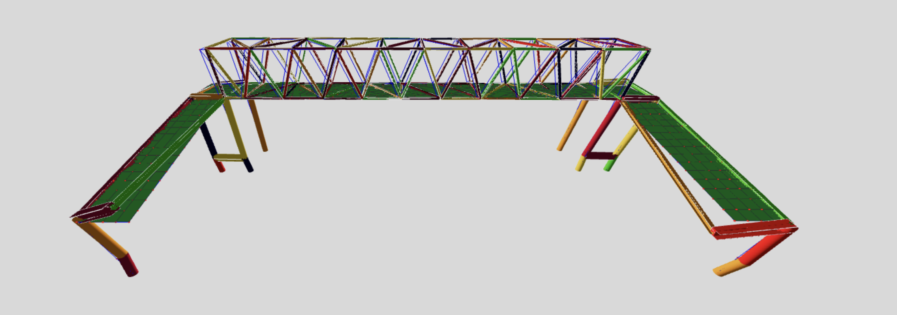

## Model Updating Application

A model updating application designed to update finite element (FE) models using OpenSees and system identification techniques.

### Main Components

- **Preprocessor**: Responsible for creating the geometry and establishing the database.
- **Engine**: Generates multiple instances of the FE model in OpenSees and executes them in parallel. Utilizes the Metropolis-Hastings algorithm to calibrate and update model parameters. The engine also communicates with the front end through APIs.
- **Front End**: Displays the model, mode shapes, and results using Three.js.

### To-Do List:

- Develop APIs for preprocessing.
- Enhance the engine functionality.
- Improve the user interface (UI).